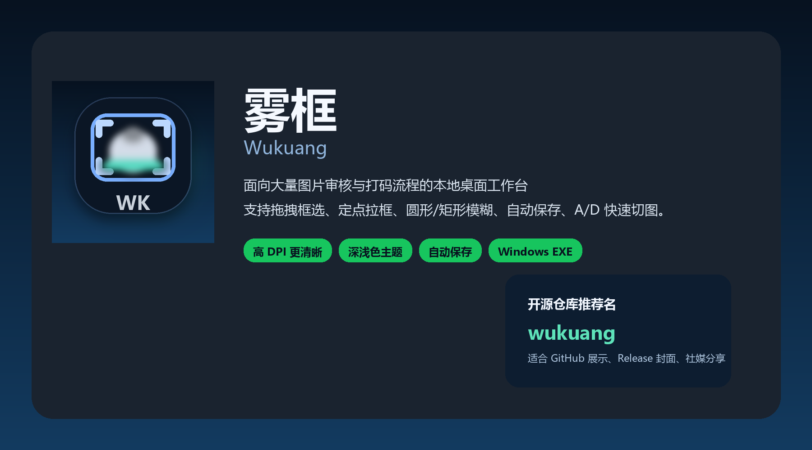

<div align="center">
  <p>
    
  </p>

[简体中文](./README.md) | [English](./README.en.md)

  <h1>Wukuang</h1>
  <p>A local desktop tool for dataset desensitization, batch image blurring, and manual sensitive-region cleanup</p>
</div>

<p align="center">
    <a href="./LICENSE"></a>
    <a href="https://github.com/verbalPoem/wukuang/releases"></a>
    <a href=""></a>
    <a href=""></a>
    <a href=""></a>
    <a href="https://github.com/verbalPoem/wukuang/releases"></a>
</p>

<p align="center">
  <a href="https://github.com/verbalPoem/wukuang/releases"><strong>Download Latest Release &raquo;</strong></a>
  <br />
  <br />
  <a href="#whats-new">What's New</a>
  &middot;
  <a href="#overview">Overview</a>
  &middot;
  <a href="#features">Features</a>
  &middot;
  <a href="#quick-start">Quick Start</a>
  &middot;
  <a href="#development">Development</a>
</p>



## What's New

### v1.0.5

- Added bilingual UI switching with `🇨🇳 ZH / 🇺🇸 EN`
- Main window, settings dialog, about dialog, and status messages now support both Chinese and English
- Replaced the thin previous/next arrows with clearer emoji-style navigation buttons
- Fixed continuous browsing when long-pressing the top `A / D` buttons with the mouse
- Refined the README and marketing assets to remove placeholder-like AI-looking text

### v1.0.4

- Streamlined sibling-folder navigation to work only on direct child folders sorted by name
- Removed automatic sibling-folder prescan when opening a folder, improving responsiveness on external drives
- Parent-folder progress is now counted manually

### v1.0.3

- Added fixed-size single-click masking mode
- Added a live blue preview box that follows the cursor
- Added preset sizes: `64 / 96 / 128`

## Overview

`Wukuang` is not a general-purpose image editor. It is a focused desktop workstation built for one specific workflow:

1. Use `YOLO` or another detection model to remove most sensitive regions
2. Open a folder locally
3. Quickly clean up the remaining missed areas by hand
4. Save and move on to the next image

It is especially useful for:

- dataset desensitization
- image review workflows
- face blurring
- privacy protection
- sensitive-region masking
- manual cleanup after automatic detection

## Preview

<video src="./assets/app-preview.mp4" width="100%" controls>
</video>

## Features

- Three selection modes: drag, two-click point mode, and fixed-size single-click mode
- Two shapes: rectangle and circle
- Rounded rectangle support with matching live preview
- Three processing modes: Gaussian, Pixelate, and Inpaint
- Auto save with overwrite or `blurred_output` export
- `A / D` image browsing with long-press repeat
- `Shift + A / Shift + D` sibling-folder navigation
- `Ctrl + Z` undo and `R` reload
- High-DPI friendly Windows desktop UI
- Light / dark themes and bilingual UI

<details>
<summary><strong>Why this tool matters</strong></summary>

In many real pipelines, the expensive part is not model inference itself.  
The painful part is the final manual cleanup after the model has already handled 80% to 90% of the job.

`Wukuang` is designed exactly for that final human-in-the-loop stage.

</details>

<details>
<summary><strong>Workflow details</strong></summary>

- drag and release
- two-click point confirmation
- fixed-size one-click masking
- real-time blue preview box
- sibling subfolder navigation
- manual parent-folder progress counting
- highlighted status feedback
- preview cache and neighbor prefetch

</details>

## Quick Start

### 1. Prepare an image folder

- Put the images you want to process into one subfolder
- Supported formats: `jpg`, `jpeg`, `png`, `bmp`, `webp`

### 2. Open a folder

- Launch the app
- Click `Open Image Folder`
- Choose the folder you want to process

### 3. Start masking

- Use drag mode or point mode
- Or switch to fixed-size mode and click repeatedly for fast masking
- Press `D` for next image and `A` for previous image
- Press `Shift + D / Shift + A` to move between sibling folders

### 4. Choose a processing style

- `Gaussian`: best for faces and general sensitive areas
- `Pixelate`: stronger blocking effect
- `Inpaint`: useful for removing text, watermarks, and small overlays

## Shortcuts

| Action | Shortcut |
| :--- | :--- |
| Previous image | `A` |
| Next image | `D` |
| Continuous flipping | Hold `A / D` |
| Previous subfolder | `Shift + A` |
| Next subfolder | `Shift + D` |
| Undo | `Ctrl + Z` |
| Reload current image | `R` |
| Open folder | `Ctrl + O` |

## Development

### Environment

- Windows 10 / 11
- Python 3.12
- PySide6
- OpenCV
- Pillow
- NumPy

### Run from source

```powershell
python face_blur_studio.py
```

### Build Windows EXE

```powershell
build_exe.bat
```

### Manual build

```powershell
py -3.12 -m venv .venv
.venv\Scripts\activate
python -m pip install -r requirements.txt pyinstaller
python scripts\generate_brand_assets.py
pyinstaller --noconfirm --clean --windowed --icon assets\app-icon.ico --name BlurStudio face_blur_studio.py
```

## Docs

- [v1.0.4 Development Guide](./docs/Wukuang-v1.0.4-开发文档.md)
- [GitHub Releases](https://github.com/verbalPoem/wukuang/releases)

## Project Structure

```text
assets/
  app-icon.ico
  app-icon.png
  app-preview.mp4
  release-cover.png
  screenshot-sheet.png
scripts/
  generate_brand_assets.py
docs/
  Wukuang-v1.0.4-开发文档.md
face_blur_studio.py
wukuang_qt.py
build_exe.bat
requirements.txt
README.md
README.en.md
LICENSE
```

## Tech Stack

- GUI: `PySide6`
- Image processing: `OpenCV` + `Pillow` + `NumPy`
- System integration: `ctypes`
- Packaging: `PyInstaller`
- Language: `Python 3.12`

## Notes

- `Inpaint` is best for small-area repair, not large-scale reconstruction
- Overwriting `JPEG` images is still limited by the format's lossy nature
- Very large images may still take time on first load, although preview caching and delayed prefetch already reduce most visible lag

## Authors

- Developers: `cca&qyx&codex`
- Goal: make batch image masking faster and smoother during long review sessions

## License

This project is licensed under the [MIT License](./LICENSE).

## Roadmap

- model-assisted pre-blur workflow
- multi-box batch confirmation
- stronger zoom/pan canvas interaction
- more shapes and shortcut customization
