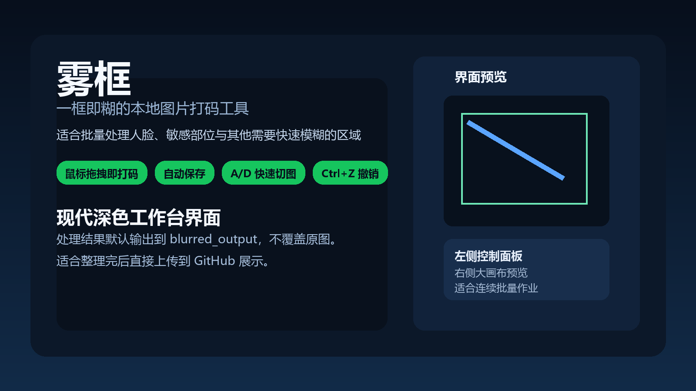
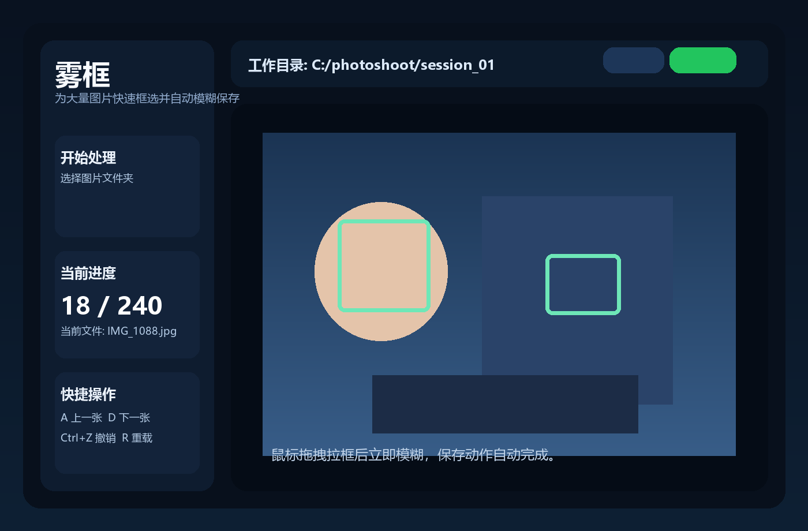
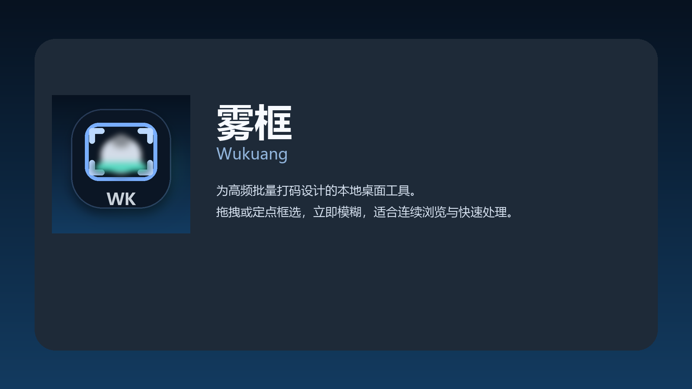
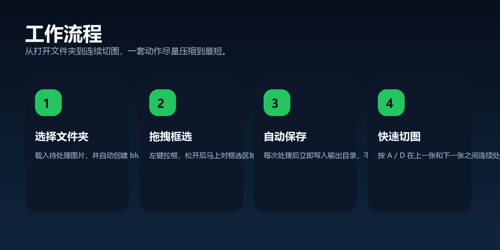

# 雾框

> 一个专门为批量图片打码设计的本地桌面工具。  
> 支持拖拽框选、定点拉框、矩形与圆形模糊、自动保存、`A / D` 快速切图，以及更适合 2K / 4K 屏幕的高清显示体验。



## 项目简介

`雾框` 的目标不是做一个复杂的通用修图器，而是做一个真正顺手的“批量打码工作台”。

它适合下面这种高频流程：

- 打开一个图片目录
- 用鼠标快速框出人脸或敏感区域
- 松手或者第二次点击后立即模糊
- 自动保存
- 按 `D` 继续下一张

整个流程尽量减少重复点击，让你在大量图片里保持节奏。

## 名称含义

- `雾`：代表模糊、遮挡、雾化处理
- `框`：代表核心操作就是用鼠标框选区域

这是一个很短、很好记、而且很适合继续做成产品名字的中文名。

## 功能特性

- 鼠标拖拽框选，松手立即模糊
- 定点框选模式：点击一次确定起点，移动鼠标，第二次点击确认
- 支持矩形模糊
- 支持圆形模糊
- 自动保存到 `blurred_output`
- 原图不覆盖
- `A / D` 快速切换上一张和下一张
- `Ctrl + Z` 撤销上一次模糊
- `R` 重新载入当前图片
- 深色 / 浅色主题切换
- Windows 标题栏跟随主题变深或变浅
- 高 DPI 适配，改善 2560×1440、4K 等高分屏下的模糊显示问题
- 再次打开同一目录时优先加载已处理版本，方便断点续做

## 界面预览



## 图标展示



## 工作流程



## 使用场景

- 批量给照片中的人脸打码
- 处理敏感身体部位
- 审核截图、聊天记录、证件照、车牌、账号信息
- 整理公开视频素材或训练数据前处理
- 长时间“看一张、框一下、下一张”的重复工作

## 两种框选方式

### 1. 拖拽模式

- 按住鼠标左键开始拉框
- 松手后立即执行模糊

适合快速、连续处理。

### 2. 定点模式

- 先点击一次，确定起点
- 移动鼠标调整框的大小
- 再点击一次确认

适合更精细的定位，尤其是你不想一直按着鼠标的时候。

## 模糊形状

- `矩形`
- `圆形`

你可以在左侧控制区里随时切换。

## 快捷键

| 操作 | 快捷键 |
| --- | --- |
| 上一张图片 | `A` |
| 下一张图片 | `D` |
| 撤销上一次模糊 | `Ctrl + Z` |
| 重新载入当前图片 | `R` |

## 技术栈

这个项目目前主要使用了这些技术：

- `Python 3.12`
- `Tkinter`
  用来构建本地桌面 GUI
- `ttk / clam theme`
  用来做更现代一些的桌面控件样式
- `Pillow`
  用来做图片加载、缩放、界面预览，以及品牌图标资产生成
- `OpenCV`
  用来执行高斯模糊处理
- `NumPy`
  用来处理图像像素数组与圆形蒙版混合
- `ctypes`
  用来调用 Windows DPI 与标题栏主题相关的系统接口
- `PyInstaller`
  用来打包成 Windows `exe`

## 支持的图片格式

- `jpg`
- `jpeg`
- `png`
- `bmp`
- `webp`

## 运行方式

### 1. 直接运行 Python 版本

```powershell
python face_blur_studio.py
```

### 2. 直接运行 EXE

打包后的程序在：

```text
dist/BlurStudio/BlurStudio.exe
```

双击即可运行。

## 打包成 EXE

如果你想重新构建：

```powershell
build_exe.bat
```

这个脚本会自动：

- 安装依赖
- 生成应用图标
- 调用 PyInstaller 打包

如果你想手动执行：

```powershell
py -3.12 -m venv .venv
.venv\Scripts\activate
python -m pip install -r requirements.txt pyinstaller
python scripts\generate_brand_assets.py
pyinstaller --noconfirm --clean --windowed --icon assets\app-icon.ico --name BlurStudio face_blur_studio.py
```

## 自动保存逻辑

- 选择图片目录后，会自动创建 `blurred_output`
- 每次模糊操作后，立即自动保存
- 原图不会被覆盖
- 已处理图片下次会优先被重新载入

这意味着你可以做到：

- 随时中断
- 随时继续
- 不怕忘记保存

## 高分屏与主题说明

这个版本针对你提到的高分屏显示问题做了专门处理：

- 启用 Windows DPI aware 模式，减少高分屏缩放造成的界面发虚
- 提高默认窗口尺寸与字体尺寸
- 让标题栏在深色主题下尽量贴近暗色风格
- 提供深色 / 浅色切换按钮

如果你的 Windows 系统本身开启了高对比度或特殊缩放策略，实际外观仍然可能会受到系统设置影响，但会比默认 Tk 程序清晰很多。

## 项目结构

```text
.
├─ assets/
│  ├─ app-icon.ico
│  ├─ app-icon.png
│  ├─ app-icon-preview.png
│  ├─ app-preview.png
│  ├─ banner.png
│  └─ workflow.png
├─ scripts/
│  ├─ generate_brand_assets.py
│  └─ generate_readme_images.py
├─ face_blur_studio.py
├─ build_exe.bat
├─ requirements.txt
├─ LICENSE
└─ README.md
```

## 开源许可

本项目使用 [MIT License](./LICENSE)。

如果你准备公开放到 GitHub，这个许可足够常见，也比较适合这种桌面效率工具。


## 后续升级

- 自动人脸检测后先预打码
- 马赛克模式
- 多框批量确认
- 缩放和平移画布
- 形状继续扩展成多边形
- 快捷键自定义
- 更完整的项目设置页
