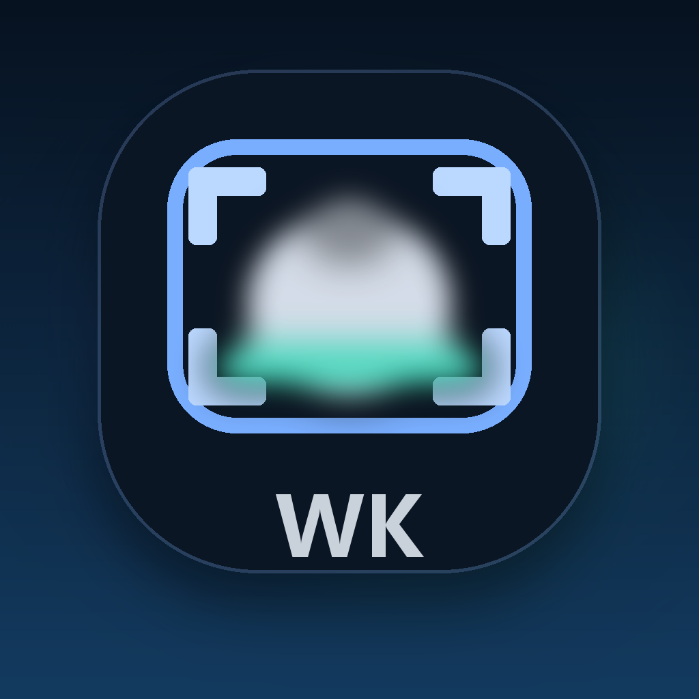

<br />
<div align="center">
  

  <h1 align="center" style="margin-top: 0.2em;">雾框 Wukuang</h1>

  [![Python][python-badge]][python-url]
  [![PySide6][pyside-badge]][pyside-url]
  [![OpenCV][opencv-badge]][opencv-url]
  [![Pillow][pillow-badge]][pillow-url]
  [![PyInstaller][pyinstaller-badge]][pyinstaller-url]

  <p align="center">
    <h3>一个为批量图片打码而生的本地桌面工作台</h3>
    <br />
    <a href="https://github.com/verbalPoem/wukuang/releases"><strong>下载最新版本 &raquo;</strong></a>
    <br />
    <br />
    <a href="#功能特性">功能特性</a>
    &middot;
    <a href="#快速开始">快速开始</a>
    &middot;
    <a href="#开发说明">开发说明</a>
    &middot;
    <a href="#已知说明">已知说明</a>
    &middot;
    <a href="#开源许可">开源许可</a>
  </p>
</div>

<details>
  <summary>目录</summary>
  <ol>
    <li><a href="#功能特性">功能特性</a></li>
    <li><a href="#为什么做这个项目">为什么做这个项目</a></li>
    <li><a href="#界面预览">界面预览</a></li>
    <li><a href="#快速开始">快速开始</a></li>
    <li><a href="#快捷键">快捷键</a></li>
    <li><a href="#开发说明">开发说明</a></li>
    <li><a href="#项目结构">项目结构</a></li>
    <li><a href="#已知说明">已知说明</a></li>
    <li><a href="#关于作者">关于作者</a></li>
    <li><a href="#开源许可">开源许可</a></li>
  </ol>
</details>

## 功能特性

<p align="center">
  
  
</p>

- **面向批量打码场景**：打开图片目录后持续处理，适合一整批数据集、截图或素材审核流程
- **两种框选方式**：支持拖拽松手确认，也支持定点两次点击确认
- **两种处理形状**：支持矩形和圆形，矩形还支持可调圆角
- **三种处理模式**：`高斯`、`马赛克`、`修复（Inpaint）`
- **自动保存**：支持覆盖原图，也支持输出到 `blurred_output`
- **连续翻页**：`A / D` 切图，长按可连续快速浏览整个文件夹
- **撤销与重载**：支持 `Ctrl + Z` 撤销、`R` 重新载入当前图
- **高分屏友好**：针对 Windows 高 DPI 显示做了适配
- **现代桌面界面**：基于 `PySide6`，支持浅色 / 深色主题、设置面板和更统一的控件风格
- **性能优化**：内置预览缓存、邻近图片预加载，并在打码和撤销后直接以内存图刷新画布，减少等待感

## 为什么做这个项目

`雾框` 的目标很简单：做一个真正顺手的批量图片打码工具，而不是一个功能很多但流程很重的通用修图器。

它想解决的是这类高频工作：

- 看一张图
- 框出人脸、敏感部位、文字或隐私信息
- 立即处理
- 自动保存
- 继续下一张

整个流程尽量减少重复点击、减少额外弹窗、减少手从键盘和鼠标之间来回切换的次数。

## 界面预览


## 快速开始

### 第一步：准备图片目录

- 把待处理图片放在同一个文件夹中
- 支持 `jpg`、`jpeg`、`png`、`bmp`、`webp`

### 第二步：打开应用并选择目录

- 启动 `雾框`
- 点击左侧的“打开图片目录”
- 选择你要处理的图片文件夹

### 第三步：开始打码

- 用鼠标框选需要处理的区域
- 松手或第二次点击后立即执行处理
- 按 `D` 进入下一张，按 `A` 返回上一张

### 第四步：根据场景切换处理方式

- `高斯`：适合人脸、身体敏感区域
- `马赛克`：适合需要更强遮挡感的区域
- `修复`：适合去除小块文字、水印和遮挡

### 第五步：必要时撤销

- 按 `Ctrl + Z` 立即撤销上一步
- 状态栏会高亮显示“已撤销上一步”

## 快捷键

| 操作 | 快捷键 |
|------|--------|
| 上一张图片 | `A` |
| 下一张图片 | `D` |
| 连续快速翻页 | 长按 `A / D` |
| 撤销上一步 | `Ctrl + Z` |
| 重新载入当前图片 | `R` |
| 打开目录 | `Ctrl + O` |

## 开发说明

### 推荐环境

- Windows 10 / 11
- Python 3.12
- 建议使用高分屏显示器时保持系统缩放正常开启

### 从源码运行

```powershell
python face_blur_studio.py
```

### 打包为 EXE

```powershell
build_exe.bat
```

### 手动构建

```powershell
py -3.12 -m venv .venv
.venv\Scripts\activate
python -m pip install -r requirements.txt pyinstaller
python scripts\generate_brand_assets.py
pyinstaller --noconfirm --clean --windowed --icon assets\app-icon.ico --name BlurStudio face_blur_studio.py
```

### 常用命令

| 命令 | 说明 |
|------|------|
| `python face_blur_studio.py` | 运行桌面应用 |
| `py -3.12 -m py_compile wukuang_qt.py` | 语法检查 |
| `build_exe.bat` | 构建 Windows EXE |

### 技术栈

| 层级 | 技术 |
|------|------|
| 桌面 GUI | [PySide6](https://doc.qt.io/qtforpython-6/) |
| 图像处理 | [OpenCV](https://opencv.org/) + [Pillow](https://python-pillow.org/) + [NumPy](https://numpy.org/) |
| 系统适配 | `ctypes` |
| 打包 | [PyInstaller](https://pyinstaller.org/) |
| 语言 | [Python 3.12](https://www.python.org/) |

### 当前架构

```text
┌─────────────────────────────────────────────────────────┐
│                     雾框 Wukuang                       │
│                                                         │
│  ┌──────────────────┐         ┌──────────────────────┐  │
│  │   PySide6 UI     │         │   Image Pipeline     │  │
│  │                  │         │                      │  │
│  │  Sidebar         │         │  Pillow load/save    │  │
│  │  Settings Dialog │◄──────► │  OpenCV blur/inpaint │  │
│  │  Canvas Preview  │         │  NumPy mask process  │  │
│  │  Status Bar      │         │  Preview cache       │  │
│  └──────────────────┘         └──────────────────────┘  │
│                                                         │
│                    Local image folders                  │
└─────────────────────────────────────────────────────────┘
```

### 图片保存策略

- `PNG` 以无损方式保存
- `JPEG / JPG` 以尽量高质量方式保存：
  `quality=100`、`subsampling=0`、关闭额外优化压缩

需要说明的是，`JPEG` 本身是有损格式，所以覆盖保存时无法做到严格意义上的完全无损；当前实现已经尽量避免额外画质损失。

## 项目结构

```text
assets/
  app-icon.ico
  app-icon.png
  app-icon-preview.png
  app-preview.png
  banner.png
  workflow.png
scripts/
  generate_brand_assets.py
  generate_readme_images.py
face_blur_studio.py
wukuang_qt.py
build_exe.bat
requirements.txt
LICENSE
README.md
```

## 已知说明

- `修复（Inpaint）` 更适合小范围文字、水印和局部遮挡，不适合大面积内容重建
- 如果原图是 `JPEG`，覆盖保存时仍然受限于 JPEG 自身的有损格式特性
- 非常大的原图在首次载入时仍然会有一定等待时间，但当前版本已经通过预览缓存和延迟预加载减少了大部分卡顿

## 关于作者

应用内点击左上角 Logo 可以查看开发者信息。

- 开发者：`cca&qyx&codex`
- 开发目的：让批量图片打码流程更高效、更顺手，适合长时间连续处理

## 开源许可

本项目使用 [MIT License](./LICENSE)。

如果你准备公开放到 GitHub，这个许可足够常见，也比较适合这种桌面效率工具。

## 后续升级

- 自动人脸检测后先预打码
- 多框批量确认
- 缩放和平移画布
- 形状继续扩展成多边形
- 快捷键自定义
- 更完整的项目设置页

[python-badge]: https://img.shields.io/badge/Python-3.12-3776AB?style=for-the-badge&logo=python&logoColor=white
[python-url]: https://www.python.org/
[pyside-badge]: https://img.shields.io/badge/PySide6-Qt_for_Python-41CD52?style=for-the-badge&logo=qt&logoColor=white
[pyside-url]: https://doc.qt.io/qtforpython-6/
[opencv-badge]: https://img.shields.io/badge/OpenCV-Image_Processing-5C3EE8?style=for-the-badge&logo=opencv&logoColor=white
[opencv-url]: https://opencv.org/
[pillow-badge]: https://img.shields.io/badge/Pillow-Image_IO-8CAAE6?style=for-the-badge
[pillow-url]: https://python-pillow.org/
[pyinstaller-badge]: https://img.shields.io/badge/PyInstaller-Windows_EXE-EE4C2C?style=for-the-badge
[pyinstaller-url]: https://pyinstaller.org/
