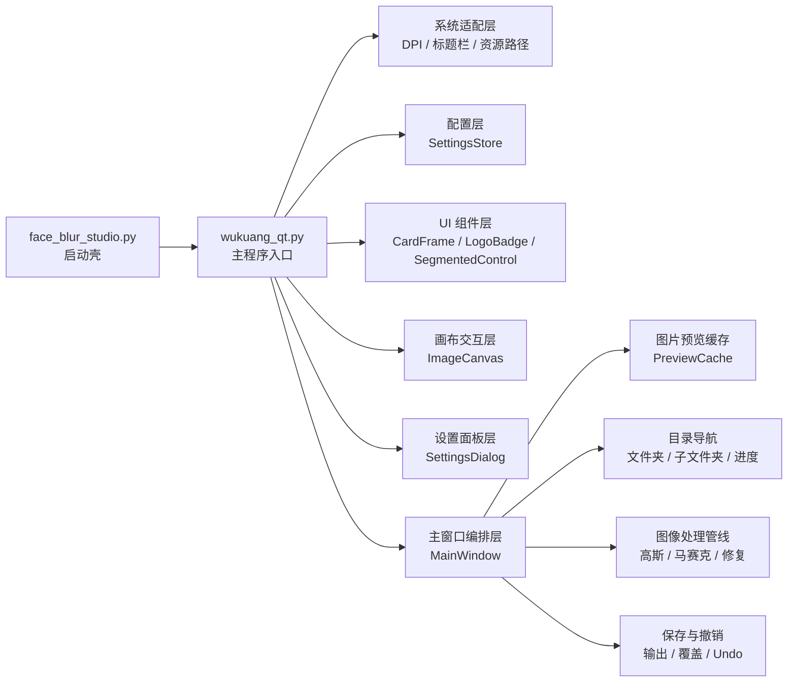
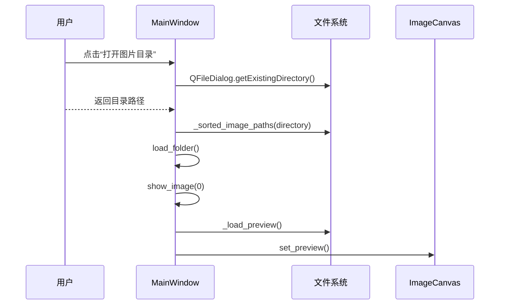
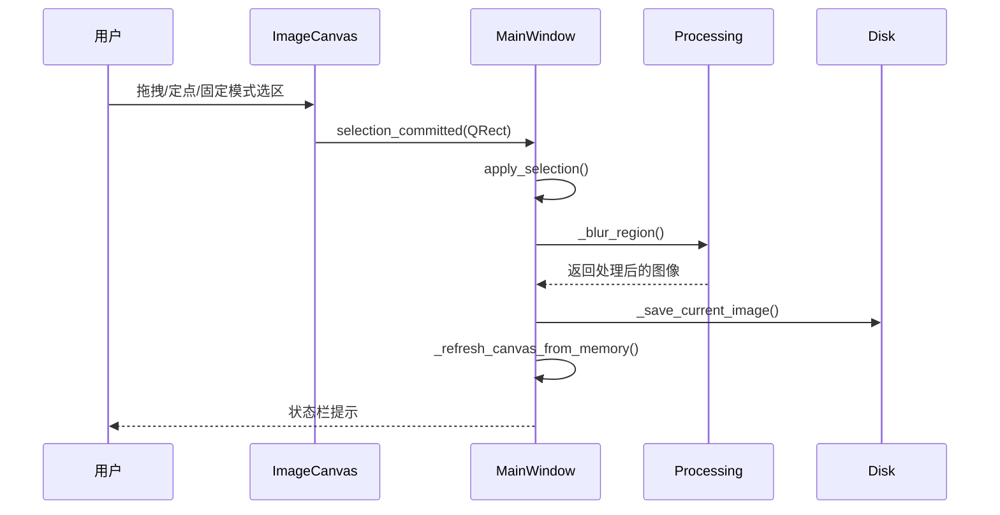
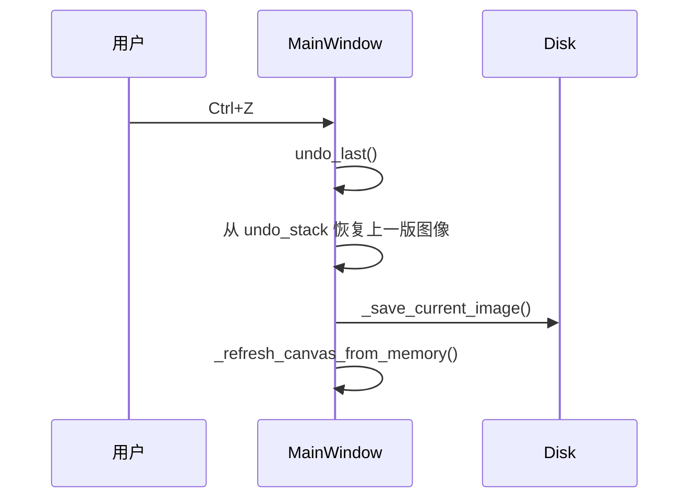

# Wukuang v1.0.4 软件开发文档

## 1. 文档说明

本文档面向以下读者：

- 当前项目维护者
- 计划参与协作开发的工程师
- 需要进行二次开发、移植或重构的技术人员
- 需要理解产品实现方式的产品经理、测试工程师或技术负责人

文档目标：

- 从工程角度系统说明 `Wukuang v1.0.4` 的产品定位、架构设计、核心模块与关键算法
- 给出主要功能的实现思路、状态流转、交互链路和对应代码位置
- 为后续扩展、测试、打包、性能调优和工业化改造提供基础设计资料

当前版本基线：

- 产品版本：`v1.0.4`
- 主要入口：`face_blur_studio.py`
- 核心实现：`wukuang_qt.py`
- GUI 框架：`PySide6`
- 图像处理：`OpenCV + Pillow + NumPy`
- 打包方案：`PyInstaller`

---

## 2. 产品定位与设计目标

`Wukuang` 是一个面向“批量图片去敏感 / 打码 / 人工补漏”的本地桌面工具。它不是通用型修图软件，而是围绕“连续处理大量图片”的工作流进行设计。

其设计目标有三个：

1. 让用户以最低认知负担持续处理大量图片
2. 在本地运行，避免敏感数据上传到云端
3. 在自动检测模型之后，提供一个高效的人工补漏工具

典型工作流如下：

1. 自动检测模型先处理掉大部分敏感区域
2. 人工打开某个图片子目录
3. 用拖拽、定点或固定大小点选的方式补齐漏网区域
4. 自动保存
5. 用 `A / D` 或 `Shift + A / Shift + D` 快速浏览整个数据集

---

## 3. 总体架构

从工程角度，当前应用属于典型的“单进程桌面 GUI + 本地图像处理引擎”架构。



### 3.1 文件结构

```text
codex/
├─ face_blur_studio.py          # 启动入口
├─ wukuang_qt.py                # 主应用与核心逻辑
├─ build_exe.bat                # Windows 打包脚本
├─ requirements.txt             # 运行依赖
├─ assets/                      # 图标、README 展示图等资源
├─ scripts/
│  └─ generate_brand_assets.py  # 品牌资源生成脚本
└─ docs/
   └─ Wukuang-v1.0.4-开发文档.md
```

### 3.2 模块职责划分

| 模块 | 责任 |
|------|------|
| 启动层 | 初始化应用入口、转交主程序 |
| 系统适配层 | 资源路径解析、高 DPI 适配、Windows 标题栏深浅模式 |
| 配置层 | 读取与保存用户偏好 |
| UI 组件层 | 封装统一风格的卡片、分段按钮、Logo 控件 |
| 画布交互层 | 处理拖拽、定点、固定大小三种框选模式 |
| 主窗口层 | 协调目录、图片显示、快捷键、设置、状态栏 |
| 图像处理层 | 高斯、马赛克、Inpaint 修复 |
| 缓存与性能层 | 预览缓存、预加载、内存刷新 |
| 打包层 | 构建虚拟环境、安装依赖、生成图标、打包 EXE |

---

## 4. 启动与系统适配

### 4.1 启动入口

主启动文件非常薄，只承担启动壳作用：

文件：[face_blur_studio.py](/C:/Users/26044/Desktop/codex/face_blur_studio.py)

```python
from wukuang_qt import main


if __name__ == "__main__":
    main()
```

设计思路：

- 将启动入口与主逻辑分离，避免 PyInstaller 直接对超大主文件打包时耦合过重
- 保持入口稳定，便于未来替换 UI 框架或主程序实现

### 4.2 资源路径解析

文件：[wukuang_qt.py](/C:/Users/26044/Desktop/codex/wukuang_qt.py)

```python
def resource_path(*parts: str) -> Path:
    base = Path(getattr(sys, "_MEIPASS", Path(__file__).resolve().parent))
    return base.joinpath(*parts)
```

设计思路：

- 在源码运行时，资源相对当前 Python 文件解析
- 在 PyInstaller 打包后，资源从 `_MEIPASS` 临时目录解析
- 避免开发态与发布态分叉两套资源读取逻辑

### 4.3 高 DPI 适配

```python
def enable_high_dpi() -> None:
    if not hasattr(ctypes, "windll"):
        return
    try:
        ctypes.windll.shcore.SetProcessDpiAwareness(2)
    except OSError:
        try:
            ctypes.windll.user32.SetProcessDPIAware()
        except OSError:
            pass
```

设计思路：

- 优先使用 `SetProcessDpiAwareness(2)` 提升 Windows 高分屏显示质量
- 如果系统较旧，则回退到 `SetProcessDPIAware`
- 将 DPI 处理放在 `QApplication` 创建之前调用，避免控件尺寸在启动阶段被错误缩放

### 4.4 Windows 标题栏主题适配

```python
def enable_windows_titlebar(win_id: int, dark: bool) -> None:
    if not win_id or not hasattr(ctypes, "windll"):
        return
    value = ctypes.c_int(1 if dark else 0)
    for attribute in (20, 19):
        try:
            ctypes.windll.dwmapi.DwmSetWindowAttribute(
                wintypes.HWND(win_id),
                wintypes.DWORD(attribute),
                ctypes.byref(value),
                ctypes.sizeof(value),
            )
        except OSError:
            continue
```

设计思路：

- 使用 DWM 接口同步系统标题栏颜色
- 尝试多个属性编号以兼容不同 Windows 版本
- 让系统原生窗口边框尽量与应用主题保持一致

---

## 5. 配置管理模块

### 5.1 配置项定义

```python
DEFAULT_SETTINGS = {
    "theme_mode": "light",
    "draw_mode": "drag",
    "shape_mode": "rect",
    "blur_style": "gaussian",
    "blur_kernel": 61,
    "corner_radius": 18,
    "fixed_box_width": 180,
    "fixed_box_height": 180,
    "auto_advance": False,
    "save_mode": "overwrite",
    "prefetch_span": 4,
}
```

配置项涵盖：

- 主题模式
- 框选模式
- 形状模式
- 模糊样式
- 模糊核大小
- 圆角半径
- 固定尺寸框宽高
- 自动跳图
- 保存策略
- 预加载数量

### 5.2 SettingsStore 设计

```python
class SettingsStore:
    @staticmethod
    def load() -> dict:
        data = DEFAULT_SETTINGS.copy()
        if SETTINGS_PATH.exists():
            try:
                loaded = json.loads(SETTINGS_PATH.read_text(encoding="utf-8"))
                if isinstance(loaded, dict):
                    for key in data:
                        if key in loaded:
                            data[key] = loaded[key]
            except (OSError, json.JSONDecodeError):
                pass
        return data

    @staticmethod
    def save(data: dict) -> None:
        SETTINGS_PATH.parent.mkdir(parents=True, exist_ok=True)
        SETTINGS_PATH.write_text(json.dumps(data, ensure_ascii=False, indent=2), encoding="utf-8")
```

设计思路：

- 使用 JSON 作为轻量级用户配置存储格式
- `load()` 采用“默认值覆盖式合并”，保证新增配置项具备向后兼容性
- `save()` 直接全量落盘，逻辑简单可靠，适合单用户本地桌面应用

工业化建议：

- 若后续存在配置迁移需求，可引入 `settings_version`
- 若设置项继续增加，可拆分为 dataclass 或 typed schema
- 若要支持团队共享配置，应把用户态配置与项目态配置分离

---

## 6. UI 基础组件模块

当前 UI 不是使用 Qt Designer，而是采用纯 Python 代码构建。这样做的优点是：

- 更容易精确控制布局和状态联动
- 更适合频繁迭代的个人项目
- 便于将视觉样式和交互逻辑一起维护

### 6.1 CardFrame

```python
class CardFrame(QFrame):
    def __init__(self, object_name: str = "card", parent: QWidget | None = None) -> None:
        super().__init__(parent)
        self.setObjectName(object_name)
        self.setFrameShape(QFrame.Shape.NoFrame)
        shadow = QGraphicsDropShadowEffect(self)
        shadow.setBlurRadius(20)
        shadow.setOffset(0, 6)
        shadow.setColor(QColor(8, 14, 28, 18))
        self.setGraphicsEffect(shadow)
```

责任：

- 封装统一的卡片样式基础容器
- 通过阴影和圆角配合主题样式表实现现代化桌面视觉

### 6.2 LogoBadge

```python
class LogoBadge(QWidget):
    clicked = Signal()

    def enterEvent(self, _event) -> None:
        self._animate_to(1.08)

    def leaveEvent(self, _event) -> None:
        self._animate_to(1.0)

    def mousePressEvent(self, event) -> None:
        if event.button() == Qt.MouseButton.LeftButton:
            self.clicked.emit()
```

责任：

- 提供品牌 logo 展示
- 实现 hover 放大动效
- 点击后打开“关于”弹窗

设计思路：

- 通过 `QPropertyAnimation` 对自定义属性 `hoverScale` 做过渡
- 在 `paintEvent()` 中直接按缩放系数绘制图标，避免额外引入复杂动画组件

### 6.3 SegmentedControl

```python
class SegmentedControl(QWidget):
    changed = Signal(object)

    def set_value(self, value: object, emit: bool = True) -> None:
        self._value = value
        for button, option_value in self._buttons:
            button.setChecked(option_value == value)
            button.style().unpolish(button)
            button.style().polish(button)
        if emit:
            self.changed.emit(value)
```

责任：

- 承载主题、框选方式、形状、模糊模式、保存模式等多种“离散状态选择”
- 提供统一的视觉语言，替代原始 `QComboBox` 或复选框

设计思路：

- 每个选项本质上是 `QPushButton`
- `set_value()` 统一管理选中态与信号广播
- `resizeEvent()` 中做文本省略处理，避免宽度不足时布局破坏

---

## 7. 画布交互模块

### 7.1 ImageCanvas 角色定义

`ImageCanvas` 是应用交互的核心。它负责：

- 显示预览图
- 维护图像显示矩形
- 处理鼠标交互
- 生成选区预览
- 把 QWidget 坐标转换为真实图像坐标

### 7.2 关键状态

```python
self._pixmap: QPixmap | None = None
self._image_size = QSize()
self._display_rect = QRect()
self._shape = "rect"
self._mode = "drag"
self._corner_radius = 18
self._fixed_box_size = QSize(...)
self._dragging = False
self._anchor: QPoint | None = None
self._current: QPoint | None = None
```

状态含义：

- `_pixmap`：当前预览图
- `_image_size`：原始图尺寸
- `_display_rect`：图像在画布中的实际显示区域
- `_mode`：框选模式
- `_shape`：矩形或圆形
- `_anchor`：起点
- `_current`：当前鼠标位置

### 7.3 三种框选模式

#### 7.3.1 拖拽模式

逻辑：

1. 鼠标按下记录 `_anchor`
2. 移动中更新 `_current`
3. 松手时提交选区

对应代码：

```python
if self._mode == "drag":
    self._dragging = True
    self._anchor = point
    self._current = point
```

#### 7.3.2 定点模式

逻辑：

1. 第一次点击确定起点
2. 鼠标移动显示预览框
3. 第二次点击确认终点并提交

#### 7.3.3 固定大小点选模式

逻辑：

1. 通过设置面板或侧边栏设置固定宽高
2. 鼠标移动时实时显示蓝色预览框
3. 鼠标位于预览框中心
4. 单击即完成一次打码

对应代码：

```python
def _fixed_widget_rect(self, point: QPoint) -> QRect:
    ...
    left = point.x() - rect_width // 2
    top = point.y() - rect_height // 2
    ...
    return QRect(left, top, rect_width, rect_height).intersected(self._display_rect)
```

```python
elif self._mode == "fixed":
    previous = self._selection_update_region(self._selection_rect())
    self._current = point if self._inside_image(point) else None
    self.update(previous.united(self._selection_update_region(self._selection_rect())))
```

### 7.4 预览框绘制

```python
rect = self._selection_rect()
if not rect.isEmpty():
    painter.setPen(QPen(QColor(89, 140, 255), 2, Qt.PenStyle.DashLine))
    if self._shape == "circle":
        painter.drawEllipse(rect)
    else:
        radius = min(self._display_corner_radius(), rect.width() // 2, rect.height() // 2)
        if radius > 0:
            painter.drawRoundedRect(rect, radius, radius)
        else:
            painter.drawRect(rect)
```

设计思路：

- 使用虚线蓝框与实际处理区域保持一致
- 矩形预览支持圆角同步，避免“预览形态”和最终处理结果不一致

### 7.5 坐标转换

选区不能直接使用 QWidget 坐标，必须映射回图像原始像素坐标：

```python
image_rect = QRect(
    int((widget_rect.left() - self._display_rect.left()) * x_ratio),
    int((widget_rect.top() - self._display_rect.top()) * y_ratio),
    max(2, int(widget_rect.width() * x_ratio)),
    max(2, int(widget_rect.height() * y_ratio)),
)
```

设计价值：

- 保证在任意窗口尺寸、任意缩放比例下，用户看到的框与最终处理区域一致

---

## 8. 设置面板模块

### 8.1 结构

`SettingsDialog` 负责承载全局偏好设置，采用滚动区域 + 分组卡片布局。

主要分组：

- 界面与交互
- 模糊与修复
- 性能

### 8.2 数据发射机制

```python
def _emit_change(self) -> None:
    ...
    self.changed.emit(
        {
            "theme_mode": self.theme_segment.value(),
            "draw_mode": self.draw_segment.value(),
            "shape_mode": self.shape_segment.value(),
            "blur_style": self.blur_segment.value(),
            "save_mode": self.save_segment.value(),
            "auto_advance": self.auto_segment.value(),
            "blur_kernel": self.kernel_slider.value(),
            "corner_radius": self.corner_slider.value(),
            "fixed_box_width": self.fixed_width_slider.value(),
            "fixed_box_height": self.fixed_height_slider.value(),
            "prefetch_span": self.prefetch_slider.value(),
        }
    )
```

设计思路：

- 设置面板自身不负责业务落盘，只负责收集当前参数并通过信号统一发射
- 由 `MainWindow` 作为唯一编排者接收设置变更，再决定如何刷新 UI 和保存配置

### 8.3 固定大小预设

```python
self.fixed_preset_segment = SegmentedControl(
    [("64", "64"), ("96", "96"), ("128", "128"), ("自定", "custom")],
    "custom"
)
```

设计目的：

- 为频繁重复打码场景提供快速尺寸切换
- 常用尺寸与自由尺寸共存

---

## 9. 主窗口编排模块

`MainWindow` 是整个系统的“应用编排层”。它不只是一个窗口，而是：

- UI 组合器
- 状态机持有者
- 业务入口协调器
- 图像处理、保存、撤销、切图、设置联动的唯一总控

### 9.1 主窗口状态

```python
self.settings = SettingsStore.load()
self.cache = PreviewCache()
self.image_size_cache: dict[Path, QSize] = {}
self.image_paths: list[Path] = []
self.current_index = -1
self.folder: Path | None = None
self.parent_folder: Path | None = None
self.sibling_folders: list[Path] = []
self.current_folder_index = -1
self._folder_progress_counted = False
self.current_source_path: Path | None = None
self.current_full_image: Image.Image | None = None
self.undo_stack: list[Image.Image] = []
```

关键设计：

- 使用显式状态字段，而非把所有状态埋在控件里
- 将“当前图像路径”“当前全量图像对象”“预览缓存”“撤销栈”明确拆分

### 9.2 UI 构建

`_build_ui()` 采用纯代码拼装，主要区域如下：

- 左侧边栏
  - Logo 与产品头部
  - 目录与进度卡片
  - 快速控制卡片
  - 处理选项卡片
  - 快捷操作卡片
- 右侧主体
  - 顶部工具条
  - 模式信息胶囊
  - 画布卡片
  - 状态栏卡片

### 9.3 样式系统

当前主题通过 `_stylesheet()` 统一生成 QSS 字符串。

设计特点：

- 单一来源：所有颜色都来自 `THEMES`
- 通过 `objectName` 区分卡片、状态栏、胶囊、按钮、分段控件
- 深浅主题切换时，通过 `_apply_theme()` 整体刷新

### 9.4 设置应用链路

```python
def _apply_setting(self, key: str, value: object) -> None:
    self.settings[key] = value
    SettingsStore.save(self.settings)
    if key in {"theme_mode", "draw_mode", "shape_mode", "corner_radius", "fixed_box_width", "fixed_box_height"}:
        self._apply_theme()
    else:
        self._update_ui_labels()
    if key == "save_mode" and self.current_index >= 0:
        self.show_image(self.current_index, force=True)
```

设计思路：

- 与画布显示强相关的配置，走 `_apply_theme()`，保证即时生效
- 普通文本标签类变化，走 `_update_ui_labels()`，降低刷新成本
- 保存模式切换时，必须重载当前图，因为预览路径可能从原图切到输出图

---

## 10. 目录与文件夹导航模块

### 10.1 当前版本设计原则

`v1.0.4` 对目录导航做了关键优化：

- 打开某个子文件夹时，只加载当前目录内图片
- `上一文件夹 / 下一文件夹` 只按上一级目录中的直接子文件夹名称顺序切换
- 不再在打开目录时预扫描所有同级子文件夹内容
- 母目录进度改为用户主动触发

这是为了保证移动硬盘和大目录场景下的稳定性。

### 10.2 当前目录图片扫描

```python
def _sorted_image_paths(self, directory: Path) -> list[Path]:
    with os.scandir(directory) as iterator:
        paths = [
            Path(entry.path)
            for entry in iterator
            if entry.is_file() and Path(entry.name).suffix.lower() in SUPPORTED_EXTENSIONS
        ]
    return sorted(paths, key=lambda path: path.name.casefold())
```

设计理由：

- `os.scandir` 比 `Path.iterdir()` 更适合大量目录项场景
- 使用扩展名白名单降低误判
- 按名称排序，保证切图顺序稳定

### 10.3 同级子文件夹加载

```python
def _ensure_sibling_folders_loaded(self) -> None:
    if self.folder is None or self.parent_folder is None:
        self.sibling_folders = []
        self.current_folder_index = -1
        return
    if self.sibling_folders and 0 <= self.current_folder_index < len(self.sibling_folders):
        return
    try:
        with os.scandir(self.parent_folder) as iterator:
            self.sibling_folders = sorted(
                [Path(entry.path) for entry in iterator if entry.is_dir()],
                key=lambda path: path.name.casefold(),
            )
    except OSError:
        self.sibling_folders = []
```

设计思路：

- 只读取“上一级目录的直接子目录”
- 不读取每个子目录内部内容
- 目录切换优先保证可用性与速度

### 10.4 母目录进度统计

```python
def count_parent_progress(self) -> None:
    if self.folder is None or self.parent_folder is None:
        self.set_status("当前目录没有可统计的母目录。", kind="warning", transient_ms=1500)
        return
    self._ensure_sibling_folders_loaded()
    self._folder_progress_counted = True
    self._update_folder_navigation_state()
    self.set_status("已统计母目录进度。", kind="success", transient_ms=1200)
```

设计思路：

- 进度统计不再影响“打开目录”
- 用户按需触发
- 工具的主路径是处理图片，不是先完成统计

---

## 11. 图片预览与性能优化模块

### 11.1 PreviewCache

```python
class PreviewCache:
    def __init__(self, max_items: int = 72) -> None:
        self.max_items = max_items
        self._cache: OrderedDict[tuple[str, int, int], QPixmap] = OrderedDict()
```

缓存键结构：

- `path`
- `target_width`
- `target_height`

设计思路：

- 同一文件在不同预览尺寸下需要独立缓存
- 使用 `OrderedDict` 实现轻量级 LRU 行为

### 11.2 预览图读取

```python
def _load_preview(self, path: Path, target: QSize) -> QPixmap:
    key = (str(path), max(640, target.width()), max(480, target.height()))
    cached = self.cache.get(key)
    if cached is not None:
        return cached
    reader = QImageReader(str(path))
    reader.setAutoTransform(True)
    ...
```

实现思路：

- 优先走 `QImageReader`，利用 Qt 解码能力和自动方向修正
- 若读取失败，则回退到 Pillow，增强鲁棒性
- 预览图尺寸受目标窗口大小约束，不直接载入全尺寸图

### 11.3 邻近图片预加载

```python
def prefetch_neighbors(self, index: int) -> None:
    ...
    span = int(self.settings["prefetch_span"])
    for delta in range(1, span + 1):
        for candidate in (index + delta, index - delta):
            if 0 <= candidate < len(self.image_paths):
                self._load_preview(...)
```

目的：

- 提升 `A / D` 切图速度
- 在用户即将切到下一张图时提前准备缓存

### 11.4 内存直接刷新

```python
def _refresh_canvas_from_memory(self) -> None:
    if self.current_full_image is None or self.current_source_path is None:
        return
    ...
    pixmap = self._pixmap_from_pil(self.current_full_image, target)
    ...
    self.canvas.set_preview(pixmap, QSize(self.current_full_image.width, self.current_full_image.height))
```

设计价值：

- 处理后和撤销后不需要重新从磁盘读取当前图
- 降低用户感知到的“闪一下 / 等一下”

---

## 12. 图像处理模块

### 12.1 处理入口

```python
def apply_selection(self, rect: QRect) -> None:
    image = self.ensure_full_image()
    ...
    self.undo_stack.append(image.copy())
    self.current_full_image = self._blur_region(image, (left, top, right, bottom))
    self._save_current_image()
```

流程说明：

1. 确保全尺寸图像已加载
2. 将画布选区裁剪到图像边界
3. 将处理前图像入撤销栈
4. 调用 `_blur_region()` 执行实际处理
5. 立即保存结果
6. 刷新缓存和预览

### 12.2 三种处理模式

#### 12.2.1 高斯模糊

```python
blurred = cv2.GaussianBlur(region, (kernel, kernel), 0)
```

适用：

- 人脸
- 敏感部位
- 需要自然模糊过渡的区域

#### 12.2.2 马赛克

```python
block = max(2, kernel // 8)
small = cv2.resize(region, (...), interpolation=cv2.INTER_LINEAR)
blurred = cv2.resize(small, (...), interpolation=cv2.INTER_NEAREST)
```

适用：

- 需要更强遮挡感的区域
- 对“不可逆阅读”要求更高的内容

#### 12.2.3 Inpaint 修复

```python
full_mask = Image.new("L", (image.width, image.height), 0)
...
working_bgr = cv2.cvtColor(working, cv2.COLOR_RGB2BGR)
repaired = cv2.inpaint(working_bgr, np.array(full_mask), 3, cv2.INPAINT_TELEA)
return Image.fromarray(cv2.cvtColor(repaired, cv2.COLOR_BGR2RGB))
```

设计思路：

- 修复不是“局部高斯”，而是构建全图 mask 后调用 `cv2.inpaint`
- 这样可获得更完整的上下文信息
- 更适合去除小块文字、水印或局部遮挡

### 12.3 两种形状

#### 圆形

```python
mask_image = Image.new("L", (right - left, bottom - top), 0)
ImageDraw.Draw(mask_image).ellipse((0, 0, right - left - 1, bottom - top - 1), fill=255)
```

#### 矩形圆角

```python
ImageDraw.Draw(mask_image).rounded_rectangle(
    (0, 0, right - left - 1, bottom - top - 1),
    radius=radius,
    fill=255,
)
```

设计价值：

- 让处理形状与目标区域语义更匹配
- 圆角矩形的视觉更柔和，尤其适合 UI 截图、人物区域和局部打码

---

## 13. 保存与撤销模块

### 13.1 保存策略

```python
def output_path(self, source: Path) -> Path:
    if self.settings["save_mode"] == "overwrite":
        return source
    output_dir = self.folder / "blurred_output"
    output_dir.mkdir(exist_ok=True)
    return output_dir / source.name
```

支持两种模式：

- `overwrite`：覆盖原图
- `separate`：输出到 `blurred_output`

### 13.2 保存参数

```python
if target.suffix.lower() in {".jpg", ".jpeg"}:
    save_kwargs["quality"] = 100
    save_kwargs["subsampling"] = 0
    save_kwargs["optimize"] = False
    save_kwargs["progressive"] = False
elif target.suffix.lower() == ".png":
    save_kwargs["compress_level"] = 0
```

设计目标：

- 避免额外压缩导致二次损伤
- 对 `JPEG` 尽量降低附加画质损失
- `PNG` 走无损保存路径

### 13.3 撤销机制

```python
def undo_last(self) -> None:
    if not self.undo_stack or self.current_source_path is None:
        self.set_status("当前没有可撤销的操作。", kind="warning", transient_ms=1500)
        return
    self.current_full_image = self.undo_stack.pop()
    self._save_current_image()
    self.cache.clear_path(self.current_source_path)
    self.cache.clear_path(self.output_path(self.current_source_path))
    self._refresh_canvas_from_memory()
    self.set_status("已撤销上一步。", kind="success", transient_ms=1600)
```

设计思路：

- 使用“整图快照”作为撤销单元
- 操作前入栈，撤销时弹栈恢复
- 撤销后立即保存到当前输出路径，保证磁盘状态与内存状态一致

工业化建议：

- 若未来支持更复杂的编辑历史，可将撤销栈升级为命令模式
- 若单图特别大，可考虑差分记录而非整图拷贝

---

## 14. 键盘快捷键与操作链路

### 14.1 快捷键逻辑

```python
if (event.modifiers() & Qt.KeyboardModifier.ShiftModifier) and event.key() == Qt.Key.Key_D:
    self.next_folder()
...
if event.key() == Qt.Key.Key_D:
    self.next_image()
    self.flip_direction = 1
    self.flip_hold_timer.start()
```

支持快捷键：

- `A / D`：上一张 / 下一张
- 长按 `A / D`：连续快速翻页
- `Shift + A / Shift + D`：上一个 / 下一个子文件夹
- `Ctrl + Z`：撤销
- `R`：重载当前图片
- `Ctrl + O`：打开目录

### 14.2 长按翻页机制

```python
self.flip_hold_timer.setInterval(240)
self.flip_repeat_timer.setInterval(58)
```

实现思路：

- 首次按键先切一张
- 按住超过 240ms 后启动重复翻页
- 重复翻页周期为 58ms

这样可避免“轻点误翻两张”的问题，同时兼顾高效浏览。

---

## 15. 状态反馈模块

### 15.1 状态栏设计

状态栏使用一块独立卡片实现，支持：

- 普通信息
- 成功
- 警告
- 错误

```python
def set_status(self, text: str, kind: str = "info", transient_ms: int = 0) -> None:
    self.status_label.setText(text)
    self.status_card.setProperty("statusKind", kind)
    self.status_label.setProperty("statusKind", kind)
    ...
```

### 15.2 自动清除高亮

```python
self.status_reset_timer = QTimer(self)
self.status_reset_timer.setSingleShot(True)
self.status_reset_timer.timeout.connect(self._clear_status_highlight)
```

设计价值：

- 让用户及时知道“保存成功”“撤销成功”“当前无可撤销项”等状态
- 避免状态栏长期停留在强高亮造成视觉疲劳

---

## 16. 打包与发布模块

文件：[build_exe.bat](/C:/Users/26044/Desktop/codex/build_exe.bat)

```bat
if not exist .venv (
    py -3.12 -m venv .venv
)

call .venv\Scripts\activate
python -m pip install --upgrade pip
python -m pip install -r requirements.txt pyinstaller
python scripts\generate_brand_assets.py

py -3.12 -m PyInstaller ^
  --noconfirm ^
  --clean ^
  --windowed ^
  --name BlurStudio ^
  --icon assets\app-icon.ico ^
  --add-data "assets\app-icon.ico;assets" ^
  face_blur_studio.py
```

打包思路：

1. 自动创建虚拟环境
2. 安装依赖
3. 先生成品牌资源
4. 用 PyInstaller 打 Windows GUI 包

### 16.1 依赖清单

文件：[requirements.txt](/C:/Users/26044/Desktop/codex/requirements.txt)

```text
PySide6>=6.11.0
Pillow>=12.0.0
opencv-python>=4.11.0
numpy>=2.0.0
```

### 16.2 当前发布形态

当前采用 `onedir` 模式：

- `BlurStudio.exe`
- `_internal/`

发布时必须整体打包为 zip，不可只分发裸 `exe`。

---

## 17. 关键调用链

### 17.1 打开目录



### 17.2 用户框选并处理



### 17.3 撤销



---

## 18. 版本 v1.0.4 的工程决策说明

### 18.1 为什么去掉自动母目录扫描

历史问题：

- 在移动硬盘场景下，打开目录时会出现白屏、卡顿
- 原因不是当前图片目录本身，而是为了“上一/下一文件夹”和“母目录进度”去提前扫描上级目录

决策：

- 目录切换功能优先
- 进度统计改为按需

收益：

- 大幅降低打开目录时的阻塞概率
- 避免机械硬盘 / 移动硬盘上因大量目录枚举导致的假死

### 18.2 为什么不做线程化图像处理

当前图像处理仍在主线程完成，原因如下：

- 每次处理区域相对较小
- 当前版本的主要瓶颈已从图像计算转移到 I/O 和目录枚举
- 主线程方案更简单，错误恢复成本更低

但若未来出现超大图、大面积修复场景，可进一步拆分：

- 预览图解码线程
- 图像处理工作线程
- 保存线程

---

## 19. 已知限制

1. 当前撤销为单图内存快照，长时间处理超大图时内存占用可能增长
2. `JPEG` 覆盖保存仍然是有损格式，无法做到严格无损
3. 当前仍为单进程单窗口模型，不支持并行批处理
4. 当前目录切换按上一级直接子目录名称排序，不对更深层级目录做自动建模
5. `Inpaint` 更适合小面积修复，不适合大面积复杂目标抹除

---

## 20. 工业化演进建议

若未来希望把项目升级到更“工业级”的桌面软件，建议按以下路径演进：

### 20.1 代码结构层面

- 将 `wukuang_qt.py` 拆分为多模块：
  - `app/main_window.py`
  - `ui/widgets/segmented.py`
  - `ui/widgets/canvas.py`
  - `services/image_service.py`
  - `services/navigation_service.py`
  - `services/settings_service.py`
- 引入类型更强的配置模型
- 为图像处理逻辑补独立单元测试

### 20.2 性能层面

- 将全尺寸图像处理下沉到工作线程
- 引入更明确的预览缓存失效策略
- 为超大目录增加目录枚举上限和异常诊断日志

### 20.3 稳定性层面

- 为所有文件 I/O 和图像读写补统一异常封装
- 增加崩溃日志与用户可反馈的错误报告
- 增加自动保存回滚保护

### 20.4 可维护性层面

- 引入 structured logging
- 为设置项建立版本迁移机制
- 增加 smoke test / packaging CI

---

## 21. 结语

`Wukuang v1.0.4` 的实现重点不在“功能堆积”，而在于围绕真实数据集去敏感工作流做交互和性能上的取舍。

它的核心工程思想可以概括为三点：

- 把复杂度留给代码，不留给用户
- 优先保证主工作流顺畅，而不是一次性把所有信息都统计齐
- 在本地桌面应用场景下，用最直接可靠的方式把“看一张、处理一张、继续下一张”这件事做到足够顺

如果后续继续演进到 `v1.1.x` 或 `v2.x`，建议优先围绕以下方向扩展：

- 异步图像处理与更强的目录浏览器
- 缩略图导航与项目会话
- 自动检测模型联动
- 更系统化的测试与模块拆分

